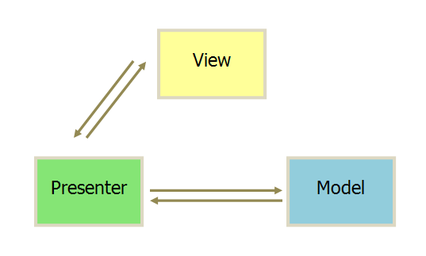

# TodoList

```
npm init
npm i webpack vue vue-loader
npm i css-loader vue-template-compiler
vim src/app.vue
vim webpack.config.js
vim src/index.js
vim package.json
sudo npm install webpack -g
sudo npm install -D webpack-cli
npm i style-loader
npm run build
npm i url-loader file-loader
npm run build
npm i stylus-loader
npm i stylus
npm run build
npm i webpack-dev-server
npm i cross-env
npm i html-webpack-plugin
npm run build
npm run dev
npm i webpack-dev-server
npm i cross-env
npm i html-webpack-plugin
npm run build
npm i postcss-loader autoprefixer babel-loader babel-core
npm i babel-preset-env babel-plugin-transform-vue-jsx
npm i babel-helper-vue-jsx-merge-props
npm i babel-plugin-syntax-jsx
vim .babelrc
vim postcss.config.js
npm run dev
mkdir src/todo
touch src/todo/header.vue
touch src/todo/footer.jsx
touch src/todo/todo.vue
touch src/todo/tabs.vue
touch src/todo/item.vue
touch src/assets/styles/globals.styl
npm i extract-text-webpack-plugin
```

## 数据绑定

>[Vue](https://cn.vuejs.org/)是一个数据绑定的框架

最开始是微软的[Knockout](http://knockoutjs.com/)首先做出来的一个双向绑定的前端类库，然后被[AngularJS](https://angularjs.org/)发扬光大

比如在 JavaScript中使用一个 Object或者某种类型写了一部分数据，但这部分数据想要显示在 HTML上面，一般的做法就是使用 JavaScript操作 DOM，然后通过 innerHTML把它添加到 HTML里面，但这种操作是比较断层的，每次修改数据都要用JS把这部分数据重新再插入一遍，这个操作就很耗时

所谓的数据绑定，就是帮助开发者把 JavaScript里面的数据直接绑定到一部分 HTML上面，数据一旦改变，HTML上的数据对应改变

## vue文件开发方式

比如一个vue文件


template定义模板、script就是 JavaScript代码部分、style部分是组件的样式，以上三个部分就构成了一个**组件**

>Vue是一个组件化的框架，即大部分写在页面上的东西都是由一个个的组件组装而成的

很显然，每个组件一定会包含 HTML、JavaScript、CSS三部分。在使用 [React](https://reactjs.org/)的时候有 [JSX](http://www.css88.com/react/docs/jsx-in-depth.html)，很好的处理了在 JavaScript当中去书写 HTML，而且 HTML是通过 render方法动态生成的，也就是每一次有数据变化的时候，它都会去执行这个 render方法然后动态生成 HTML

Vue本身对 JSX的支持并不好，所以它自创了上面的那种方式来写一个组件！script中的数据 data()对应 template中的要显示的这部分数据 \{\{text\}\}，双大括号的语法就是数据绑定的方式。下面的 style就是对应 template中某个标签的样式

Vue的这种代码组织方式使得编写一个组件变得非常直观、非常方便

## render方法

在 Vue2之后，它的核心实现也变成了虚拟 DOM，也提供了 render方法。所谓 render方法，就是一个组件中有任何数据变化的时候，都会去重新执行 render方法产生新的 HTML，以这种方式来更新 HTML的内容


## 生命周期方法

和 React一样，Vue的组件也有生命周期方法。其实在 Andriod中的 Activity不也是有[生命周期](https://www.cnblogs.com/lwbqqyumidi/p/3769113.html)的概念的吗，在不同的阶段onCreate、onStart等对应的被调用。Delphi中的Form、Button等组件不也是类似的吗！

理解Vue的生命周期方法可以很好的帮助开发者在合适的时期处理一些事情，比如在组件即将要挂在到 DOM上之前，去使用HTTP API向服务器发起一个请求，获取想要显示的数据，等等

接下来看看Vue中的生命周期是什么样的？


## computed

>Vue是一个 Reactive的框架

什么是Reactive？就是说我们声明好的一些数据，一旦去改动它的时候，会影响到依赖于这些数据的地方，比如


template里面的 \{\{text\}\}依赖于 script中 `text: 'abc'`。一旦script中的 `text: 'abc'`改变了，template的内容也对应发生改变。这就是所谓的 Reactive

什么是 computed呢？

比如在一个组件中有“姓”和“名”，这都是要用户进行输入的，这时候我们要输出的内容（显示给用户的内容）是完整的姓名。这时候我们不希望在 template中做一个字符串的拼接，那么怎么做呢？

那就声明一个 computed方法，它 return的内容是“姓”+“名”，当输入的“姓”或“名”的任何一部分发生改变，computed方法就会被重新调用，得到新的“姓名”的值！


## MVC、MVP和MVVM

MVC、MVP、MVVM这些模式是为了解决开发过程中的实际问题而提出来的，目前作为几种主流的架构模式被广泛使用

**MVC(Model-View-Controller)**

MVC是比较直观的架构模式，用户操作 -> View(负责接收用户的输入操作) -> Controller(业务逻辑处理) -> Model(数据持久化) -> View(将结果反馈给View)

MVC使用非常广泛，比如 JavaEE中的 SSH框架(Struts/Spring/Hibernate)、Python中的 Flask


**MVP(Model-View-Presenter)**

MVP是把 MVC中的 Controller换成 Presenter(呈现)，目的就是为了完全切断 View跟 Model之间的联系，由 Presenter充当桥梁，做到 View-Model之间通信的完全转换

.NET程序员熟知的 ASP.NET webform、winform基于事件驱动的开发技术就是使用的MVP模式。控件组成的页面充当 View，实体数据库操作充当 Model，而 View和 Model之间的空间数据操作则属于Presenter。控件事件的处理可以通过自定义的 IView接口实现，而 View和 IView都将对 Presenter负责



**MVVM(Model-View-ViewModel)**

如果说 MVP是对 MVC的进一步改进，那么 MVVM则是思想的完全变革。它是将“数据模型数据双向绑定”的思想作为核心，因此在 View和 Model之间的交互是双向的，因此视图的数据的变化会同时修改数据源，而数据源数据的变化也会立即反应到 View上

这方面典型的应用有 .NET的 WPF，JavaScript框架 Knockout、AngularJS、Vue等


## Vue进行MVVM开发

Vue是一个高效的、轻量级前端MVVM框架（Model/View/ViewModel）


## Error

Vue？？？？？？


